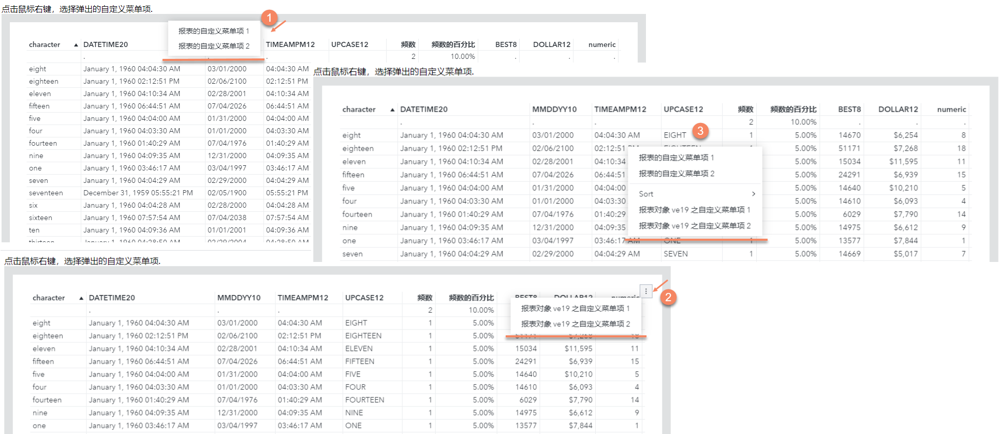
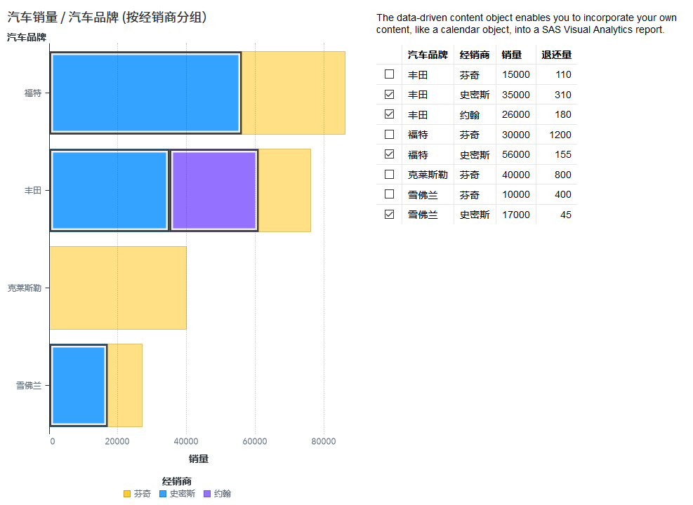
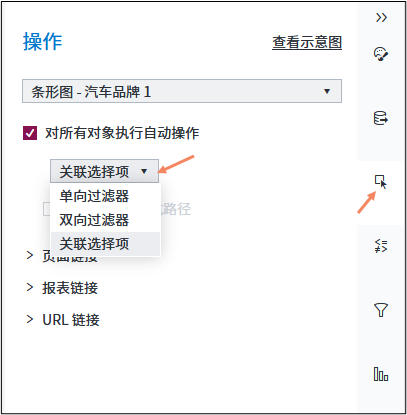
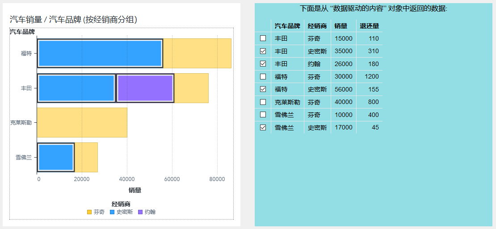

## VASDK 示例 - Part2
### 6. 生成 VA 报表的自定义菜单项

下面的代码段，是使用VA SDK生成一个自定义菜单项的例子。这里，为报表定义的2个菜单项，分别是：“报表的自定义菜单项1”和“报表的自定义菜单项2”；为报表对象定义的2个菜单项，分别是：“报表对象 <名称> 之自定义菜单项1”和“报表对象 <名称> 之自定义菜单项2”。
```
<html>
<head> <meta http-equiv="content-Type" content="text/html"> 
<script async src="https://unpkg.com/@sassoftware/va-report-components@0.14.0/dist/umd/va-report-components.js"></script>
</head>
<body>

<div id="buttons"> 单击鼠标右键，并选择弹出的自定义菜单项。  </div>
<div id="myreport">
        <sas-report id="mySASreport" authenticationType="credentials" 
        style="--
sas-report-background-color: #dfe1e2; --
sas-report-padding: 1rem;"
            url="http://sas-vaserver.com" 
            reportUri="/reports/reports/72304b2a-0ffa-4fe6-bf9b-0e26e37c8f65">
        </sas-report>
</div>
<script>
        document.addEventListener('vaReportComponents.loaded', function(){});
        const sasReport =  document.getElementById("mySASreport");
        document.onmousedown =  function() {
            sasReport.menuItemProvider = (target) => {
                if (target.type === "report") {
                    // 为报表定义菜单项
                    return [
                    {
                        // 界面上显示的菜单项文本
                        text: `报表的自定义菜单项1`,
                        // 单击菜单项后要执行的方法
                        callback: () => alert(`执行报表的自定义菜单项1`),
                    }
,
                    {
                        text: "报表的自定义菜单项2",
                        callback: () => alert("执行报表的自定义菜单项2"),
                    }
,
                    ];
                }
 else if (target.type === "object"
) {
                    // 为报表对象自定义菜单项，（含报表对象名称target.name）
                    return [
                    {
                        text: `报表对象 ${target.name} 之自定义菜单项1`,
                        callback: () => alert(`执行报表对象 ${target.name} 之自定义菜单项1`),
                    },
                    {
                        text: `报表对象 ${target.name} 之自定义菜单项2`,
                        callback: () => alert(`执行报表对象 ${target.name} 之自定义菜单项2`),
                    },
                    ];
                }
                return [];
            };

}
</script>
</body>
</html>
```

将上面的代码保存为一个Web页面，如menu.html。然后，访问http://localhost/myproj/menu.html页面， 在报表区域单击鼠标右键，会看到如图22.11中①所示的报表自定义菜单项。单击报表对象（这里是一个简单表）的工具栏菜单，可以看到为报表对象ve19生成的2个自定义菜单项，如下图中②所示。如果鼠标右键单击报表对象的任意位置，弹出的菜单将包含报表的自定义菜单项及报表对象的自定义菜单项，如下图中③所示。（注：图中的Sort菜单项，是VA报表对象的内置菜单项。）
<p align="center">
  
</p>


### 7. 与数据驱动内容对象的交互

这个例子源于Github上 VA SDK提供的一个例子，在这里根据特定的VA报表做了简单调整，并在JavaScript部分加入中文注释。

首先，在SAS Visual Analytics中创建一个报表，包含一个条形图及一个数据驱动内容对象。同时，为了便于显示交互操作的效果，为其条形图设置关联选择项操作。如下图所示，创建的报表中条形图的高亮部分，与右侧的数据驱动内容对象的选中项之间，已经建立了关联操作。
<p align="center">
  
</p>
 

接着，为条形图设置关联选择项。具体操作方法是：在条形图的右侧边栏单击  图标，打开“操作”选项卡，并选中下面的“对所有对象执行自动操作”选项，然后从下拉列表中选择“关联选择项”，如下图所示。
<p align="center">
  
</p>

然后，在SAS Visual Analytics中，分别在条形图与数据驱动内容这两个对象的上下文菜单中，单击“复制链接…”菜单项，从弹出页面中，选中“可嵌入Web组件”选项，就可以在该页面的文本框中看到ObjectName属性。本例中，条形图与数据驱动内容的ObjectName属性值分别为ve20和ve60。

接下来，创建一个Web页面，用来实现与数据驱动内容对象的交互。将这个Web页面保存到Web服务器上（命名为ddc.html），以便后续可以通过网页访问ddc.html页面。读者可以参考下面的代码，创建该Web页面的代码，只需要根据具体的报表，替换其中的url=="https://<sas-viya-server.com>"，reportUri="/reports/reports/678fcc39-0834-4726-972b-46ddca6645f3"，objectName="ve20"（条形图），及objectName: ‘ve60’（数据驱动内容对象）。
注意，在JavaScript脚本中，我们通过调用vaReportComponents.registerDataDrivenContent()函数，获得指向数据驱动内容对象的DataDrivenContentHandle对象。因此，objectName: 've60' 已经被VA SDK用作要控制的报表对象，不能再用静态的 <sas-report-object> 方式，显示原来在VA报表中所创建的数据驱动内容对象。否则，系统将提示“无法在多个上下文中使用报表对象”的错误信息。
```
<!DOCTYPE html>
<html>
  <head>
    <title>SAS Visual Analytics Custom Data Table</title>
    <script async src="https://unpkg.com/@sassoftware/va-report-components@latest/dist/umd/va-report-components.js"></script>
    <style>
      body {
        padding: 0 2rem 0 2rem;
        background-color: #f0f0f0;
      }
      .container {
        background-color: #93dee4;
        flex-grow: 1;
        flex-basis: 0;
        display: flex;
        flex-direction: column;
        justify-content: center;
        align-items: center;
      }
      .flex-container {
        display: flex;
        flex-direction: row;
      }
      .large-content {
        margin: 2rem 0 2rem 0;
        width: 100%;
        height: 800px;
      }
      .small-content {
        margin: 2rem 0 2rem 0;
        width: 100%;
        height: 500px;
      }
      .left-content {
        margin-right: 1rem;
      }
      .right-content {
        margin-left: 1rem;
      }
      sas-report-object
,
      .
ddc-container {
        width: 100%;
        height: 100%;
      }
      .ddc-container table {
        font-size: 0.8889rem;
        border-collapse: collapse;
      }
      .ddc-container th {
        text-align: left;
      }
      .ddc-container th
,
      .
ddc-container td {
        padding: 0.25rem 0.5rem;
      }
      .ddc-container tbody
,
      .
ddc-container tr + tr {
        border-top: 1px solid rgb(231, 231, 231);
      }
      .ddc-container th + th
,
      .
ddc-container td + td {
        border-left: 1px solid rgb(231, 231, 231);
      }
      .ddc-container .numeric {
        text-align: right;
      }
      .ddc-container {
        display: block;
        overflow: auto;
        margin: 1rem;
        font-family: sans-serif;
      }
    </style>
  </head>
  <body>
    <div class="flex-container small-content">
      <div class="container left-content">
        <
sas-report-object
          authenticationType="credentials"
          url="https://<sas-viya-server.com>"
          reportUri="/reports/reports/678fcc39-0834-4726-972b-46ddca6645f3"
          objectName="ve20"
        >
</sas-report-object>
      </div>
      <div class="container right-content"> 下面是从数据驱动内容对象中返回的数据:
            <div id="data-driven-content" class="ddc-container">
            </div>
      </div>
    </div>
  </body>
  <script>
    window.addEventListener('vaReportComponents.loaded', () => {
      // 注册数据驱动内容对象的句柄, 其中的objectName是在VA报表中的数据驱动内容对象的名称
      const ddcHandle = vaReportComponents.registerDataDrivenContent(
        {
          authenticationType: 'credentials',
          url: 'https://<sas-viya-server.com>'
,
          reportUri: '/reports/reports/678fcc39-0834-4726-972b-46ddca6645f3',
          objectName: 've60',
        },
        handleDataMessage
      );

      // 该函数用来接收数据，并在 'data-driven-content' div中创建一个HTML table
      function handleDataMessage(message) {
        if (message && message.rowCount >= 0) {
          // 找到brush那列的index
          const brushColumnIndex = message.columns.findIndex((column) => column.usage === 'brush');

          // 获取列名
          const columnLabels = message.columns
            .filter((column) => column.usage !== 'brush')
            .map((column) => column.label);

          // 创建HTML table的行
          const rows = message.data.map((dataRow, rowIndex) =>
            createTableRow(dataRow, brushColumnIndex, rowIndex, message.columns)
          );

          // 生成HTML table
          const table = createTable(columnLabels, rows);

          // 清空table中的原有内容
          const parentDiv = document.getElementById('data-driven-content');
          parentDiv.innerHTML = ''
;
          parentDiv.appendChild(table);

          // 为html table创建一个click事件句柄
          const resultName = message.resultName;
          table.addEventListener('click', (evt) => {
            // 将选中行的index存入一个数组 
            const selections = getTableSelections(evt.currentTarget).map((index) => {
              return { row: index }
;
            });

            // 从数据驱动内容对象发送选中的数据
            ddcHandle.dispatch({ resultName, selections });
          });
        }
      }
    });

    // 创建table
    function createTable(columnLabels, tableRows) {
      // 把列标签赋值给table列名
      const header = createTableHeader(columnLabels);

      // 生成table，并添加数据行
      let tableBody = document.createElement('tbody');
      for (const tr of tableRows) {
        tableBody.appendChild(tr);
      }

      const table = document.createElement('table');
      table.appendChild(header);
      table.appendChild(tableBody);

      return table;
    }

    // 根据给定的文本，生成HTML DOM元素
    function createElementWithText(tagName, text) {
      const element = document.createElement(tagName);
      element.appendChild(document.createTextNode(text));
      return element;
    }

    // 生成table表头列名
    function createTableHeader(columnLabels) {
      // 创建行
      let tableHead = document.createElement('thead');
      let tr = document.createElement('tr');

      // 创建列
      tr.appendChild(document.createElement('th'));

      columnLabels.forEach(function(header) {
        tr.appendChild(createElementWithText('th', header));
      });
      tableHead.appendChild(tr);
      return tableHead;
    }

    // 在table中加入数据行
    function createTableRow(dataRow, brushColumnIndex, rowNum, columns) {
      let tr = document.createElement('tr');

      // 给每行增加一个ID 
      let checkbox = document.createElement('input');
      checkbox.type = 'checkbox';
      checkbox.setAttribute('id', rowNum);
      let checkboxCell = document.createElement('td');
      checkboxCell.appendChild(checkbox);
      tr.appendChild(checkboxCell);

      // 如果brush列的值 > 0，表示某行被选中
      checkbox.checked = brushColumnIndex >= 0 && dataRow[brushColumnIndex] > 0;

      // 除brush列以外，为table的元素添加数据 
      dataRow.forEach((value, index) => {
        if (index != brushColumnIndex) {
          let td = createElementWithText('td', value);

          // 如果是 'numeric' 类型数据，使用 对应的css class.
          if (columns[index].type === 'number') {
            td.className = 'numeric';
          }
          tr.appendChild(td);
        }
      });
      return tr;
    }

    // 返回所选中的数据行 
    function getTableSelections(table) {
      const selections = [];
      if (table) {
        table.querySelectorAll(`:checked`).forEach((node) => {
          selections.push(node.id);
        });
      }
      return selections;
    }
  </script>
</html>
```

至此，访问Web服务器的http://localhost/myproj/ddc.html页面，将返回下图所示的报表。其中，右侧的数据驱动内容对象内容，就是通过JavaScript脚本调用VA SDK生成的。在该页面中单击左侧的条形图，将会刷新右侧表格中的数据；而选择右侧表格中的数据，也会刷新左侧的条形图。这样，通过VA SDK在ddc.html页面中所实现的条形图与数据驱动内容对象间的交互体验，与在SAS Visual Analytics中的一样。
<p align="center">
  
</p> 

