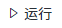
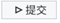

# 目录
本文档提供《数据分析不求人》一书第 20 章中部分内容的补充说明及相关示例。

[1. 数据驱动内容对象示例](https://github.com/sbjciw/VisualAnalytics/edit/master/datadriven/example.md#1-数据驱动内容对象示例)


[2. SAS Job Execution Web 应用程序](https://github.com/sbjciw/VisualAnalytics/edit/master/datadriven/example.md#2-SAS-Job-Execution-Web-应用程序)


[3. 创建 Viya 作业示例](https://github.com/sbjciw/VisualAnalytics/edit/master/datadriven/example.md#3-SAS-Job-Execution-Web-应用程序)


[4. 作业提示标签说明与示例](https://github.com/sbjciw/VisualAnalytics/edit/master/datadriven/example.md4-作业提示标签说明与示例)


## 1. 数据驱动内容对象示例

### 1) 加载第三方可视化图形

在 SAS Visual Analytics 中加载第三方可视化图形前，需要对第三方可视化图形库所提供的类及方法，以及如何与 SAS Visual Analytics 进行数据交互等有所了解。

这里以“谷歌日历”为例进行说明，网站 https://developers.google.com/chart/interactive/docs/gallery/calendar 提供了谷歌日历的详细描述。Google Charts 通过  JavaScript  类提供了许多图表类型。这些图表使用 HTML5/SVG 技术呈现，提供图表的跨浏览器兼容性、交互操作和事件操作能力。谷歌日历是 Google Charts 库中提供的一种可视化图形，设计灵感源自 D3 日历可视化，用于显示很长一段时间（如几个月或几年）的活动记录，可显示某些数值变量是如何按周天变化的趋势等。

下面说明在 SAS Visual Analytics 中加载第三方可视化图形及主要的数据交互方法。


**(1)  加载第三方可视化图形**

要创建“谷歌日历”可视化，需要在 HTML 页面中加载 Google Charts 库中 Calendar 包(package)。该可视化需要两个数据项，一个是日期项，一个是测度项。

下面的 JavaScript 代码用来加载 Google Charts 库中 Calendar 包 ：


```{#lst:code .haskell}
<script type="text/javascript" src="https://www.gstatic.com/charts/loader.js"></script>

<script type="text/javascript">
      google.charts.load("current", {packages:["calendar"]});
      google.charts.setOnLoadCallback(drawChart);
</script>
```


在 HTML 页面中呈现该图形时，需要通过 JavaScript ，首先实例化 dataTable 对象、Calendar 对象，设置 Calendar 对象的选项 (options) ，然后再进行图形绘制。以下代码参考的是 Google Charts 的部分代码。


```{#lst:code .haskell}
function drawChart() {
   	   // 实例化 dataTable 对象
       var dataTable = new google.visualization.DataTable();
       dataTable.addColumn({ type: 'date', id: 'Date' });
       dataTable.addColumn({ type: 'number', id: 'Won/Loss' });
       dataTable.addRows([
          [ new Date(2012, 3, 13), 37032 ],
          [ new Date(2012, 3, 14), 38024 ],
          [ new Date(2012, 3, 15), 38024 ],
          [ new Date(2012, 3, 16), 38108 ],
          [ new Date(2012, 3, 17), 38229 ],
        ]);

    // 实例化 Calendar 对象
    var chart = new google.visualization.Calendar(document.getElementById('calendar_basic'));

    // 设置 Calendar 对象的选项 
    var options = {
             title: "Red Sox Attendance",
             height: 350,
           };

    // 绘制 Calendar 对象
    chart.draw(dataTable, options);
}

```


**(2)  与第三方可视化图形的消息传递**

SAS Visual Analytics 使用 json 对象，与第三方可视化图形进行消息传递。传递消息的 json 对象的结构示例如下：


```{#lst:code .haskell}
{
	"version": "1",
 	"resultName": "dd24",
 	"rowCount": 2,
 	"data": [],
	"columns": []
} 

```


要传递的数据，通常保存于 event.data 对象，然后使用 HTML5 window.postMessage() API 与第三方可视化图形间相互传递消息。


**(3)  接收数据**

第三方可视化图形想要接收 SAS Visual Analytics 传递的数据，就需要一个事件侦听器（EventListener）。 下面的代码示例，为 windows 对象添加了一个 onMessage 侦听器：


```{#lst:code .haskell}
// 在 html 的 window 对象上注册 onMessage 监听器
if (window.addEventListener) {
       window.addEventListener("message", onMessage, false);
   } else {
       window.attachEvent("onmessage", onMessage);
   }

// 获取数据并进行处理
   function onMessage(event) {
       if (event && event.data)
       {
           //process event.data
       }
   }

```


每次当 SAS Visual Analytics 更新数据驱动内容对象的数据时，都会调用 onMessage() 函数。其中，event.data 对象是 Json 对象，它的一些主要属性有：

- **resultName**: 是 event.data 查询结果的名称。 SAS Visual Analytics 用该名称与数据驱动内容对象传递所有消息。

-  **data**: 查询结果所储存的二维数组。data对象是按行优先的顺序排列的。因此，event.data.data\[0]是数据的第一行，event.data.data\[0][0]是第一行的第一列。注意：该数组中的数据并未对数值数据做格式化。如果要显示格式化的数值，则必须在第三方可视化的代码中进行格式设置。对数值数据指定格式，不会对返回的数据产生影响。而日期和时间数据，则是包含了格式化的结果。

- **rowCount**: event.data对象所返回的数据行数。若已经过滤了全部数据或未给对象分配数据项，则rowCount值为0。

- **columns**: 是一个column对象的数组，可以用来设置数据类型和其他属性（如格式和标签等）。

-  **parameters**: 是一个parameter对象的数组，供数据驱动内容对象在执行查询时使用。该参数对象数组可以用来设置访问参数的当前值和其他参数属性。该数组中仅返回查询所用到的参数。

 

**(4)  选择项处理**

如果要把数据驱动内容对象中的第三方可视化图形，用作 SAS Visual Analytics 交互操作的源，每当在第三方可视化图形中进行数据选择时，都必须把所选择的数据再传递给 SAS Visual Analytics。第三方可视化图形发送给 SAS Visual Analytics 的消息，必须包含 resultName 对象；同时，SAS Visual Analytics 需要知道选中了哪些数据行，因此，发送的消息还需要包含 selections 对象，它是一个对象的数组，其中的对象指定了所选定的行索引（数组第一行的行索引为0）。selections 数组的每一个条目，都需要带有选定行值的 row 对象。

下面的 JavaScript 示例，是创建两个用来处理选择项的函数：

```{#lst:code .haskell}
function sendSelection(selectedRows, resultName) {
       var selections = [];
       if (selectedRows)
       {
           selectedRows.forEach(function (row) {
               selections.push({row: row});
           });
       }
       var message = {
           resultName: resultName,
           selections: selections
       };
       sendMessage(message);
   }

function sendMessage(message)
   {
       var url = (window.location != window.parent.location)
           ? document.referrer
           : document.location.href;
       window.parent.postMessage(message, url);
   }

```


注意，当 sendMessage() 函数调用 postMessage 方法时，需要在其父级上进行调用，并且需要将其父级的 url 作为第二个参数传入。


**(5)  关联选择项处理**

如果要把数据驱动内容对象中的第三方可视化图形，用作 SAS Visual Analytics 关联选择项的目标，则发送给数据驱动内容对象的数据，应该包含一列数据，用来告知第三方可视化图形哪些数据行被选中了。所发送消息中的 <columns> 数组中，如果某一列 的 usage 属性的值为 brush，就表示该数据列将作为关联选择控制项，它应该与其他数据分开处理。

要想使数据驱动内容对象支持关联选择项，必须在第三方可视化图形中进行选择。若选中了某一行数据，则其对应的 brush 列的值大于 0。对于未选中的数据行，则其对应的 brush 列的值为 0。

由于谷歌日历这个第三方可视化图形中，无法启用关联选择项，这里使用其他示例数据对关联选择项的处理进行说明。以下的 Json 文件中，其 <columns> 数组所定义的列中，最后一列（name 为 ri1 的列）的 usage 属性的值为 brush，因此，第一行和第三行数据被选中（即 name 为 Finch 和 Smith 的两行数据，它们最后一列的数值大于0），而第二行数据没有被选中（即 name 为 Jones 的一行数据，其最后一列的数值等于 0）。


```{#lst:code .haskell}
{
 "version" : "1",
 "resultName" : "dd40",
 "rowCount" : 3,
 "availableRowCount" : 3,
 "data" : [ [ "Finch", 95000.0, 0.42857142857142855 ], [ "Jones", 26000.0, 0.0 ],
    [ "Smith", 108000.0, 0.5 ] ],
 "columns" : [ {
   "name" : "bi184",
   "label" : "dealer",
   "type" : "string"
 }, {
   "name" : "bi258",
   "label" : "sales",
   "type" : "number",
   "usage" : "quantitative",
   "aggregation" : "sum",
   "format" : {
     "name" : "BEST",
     "width" : 12,
     "precision" : 0,
     "formatString" : "BEST12."
   }
 }, {
   "name" : "ri1",
   "type" : "number",
   "usage" : "brush",
   "format" : {
     "name" : "COMMA",
     "width" : 12,
     "precision" : 2,
     "formatString" : "COMMA12.2"
   }
 } ]
}

```


**(6)  定制说明消息**

数据驱动内容对象支持显示定制的说明消息。当分配给“变量”角色的数据，不满足第三方可视化图形的要求时，可以在 SAS Visual Analytics 的报表设计器界面中显示该说明消息。

说明消息的发送方式，与前面的选择项消息的发送方式相同，只是发送者是 message 对象，而不是 selections 对象。以下是代码示例。

```{#lst:code .haskell}
function sendNoDataMessage(resultName) {
       var message = {
           resultName: resultName,
           message: "No data items are assigned.\n
           This visual requires 1 category and 2 measures."
       };
       sendMessage(message);
   }

```


### 2)  编写第三方可视化图形页面

接下来，我们需要为数据驱动内容对象编写一个 HTML 页面，用作第三方可视化图形的显示页面。在这个 HTML 页面文件中，通过调用相关的 JavaScript 库，实现与 SAS Visual Analytics 的数据传递和交互。为了便于说明，这里以“谷歌日历”为例给出 HTML 页面的示例。

(1)   首先需要引用相关的 JS 文件，以确保这些 JS 库可以被正确调用。

本例中需要将以下三个 JS 文件加到 HTML 页面文件的 <head>段中：第一个 JS 文件（loader.js）引用的是 Google Charts 的库；第二、第三个 JS 文件（jquery-3.1.1.min.js， jquery.csv.min.js）是源自 jQuery 的库。 jQuery 是一套开源的、跨浏览器的JavaScript函数库，其中提供了很多广受欢迎的函数，可以简化 HTML 与 JavaScript 之间的操作。读者可以从 https://blog.jquery.com/2016/09/22/jquery-3-1-1-released/ 下载 jquery-3.1.1.min.js 文件，从 https://www.cdnpkg.com/jquery-csv/file/jquery.csv.min.js/ 下载 jquery.csv.min.js 文件。

```{#lst:code .haskell}
<script type="text/javascript" src="https://www.gstatic.com/charts/loader.js">
</script>

<script type="text/javascript" src="../util/jquery-3.1.1.min.js"></script>

<script type="text/javascript" src="../util/ jquery.csv.min.js"></script>

```


（2)   在 HTML 页面文件中定义一个 <div>段，用来作为显示第三方可视化图形的区域。这只需要在 <body> 段中插入类似 <div id="chart_div"/> 的代码段。

（3)   编写 JavaScript 代码，分别完成在 window 对象上注册 onMessage 监听器、处理 message 的函数，以及其他绘制第三方可视化图形所需要的函数等。这里以“谷歌日历”为例，给出部分函数的伪代码。读者可能注意到了其中包含的一些代码，与“与第三方可视化图形的消息传递”中介绍的内容是一致。具体的 HTML 页面代码，请参考以下代码段。

```html
<!DOCTYPE html> 
<!-- 
 
该示例源自于 https://github.com/sassoftware/sas-visualanalytics-thirdpartyvisualizations/tree/master/samples/, 并进行了部分修改。 
 
--> 
<html> 
<meta http-equiv="Content-Type" content="text/html; charset=GB18030"> 
<head> 
    <script type="text/javascript" src="https://www.gstatic.com/charts/loader.js"></script> 
    <script type="text/javascript" src="util/jquery-3.1.1.min.js"></script> 
    <script type="text/javascript" src="util/jquery.csv.min.js"></script> 
 
    <style> 
        html, body, #chart_div { 
            width: 100%; 
            height: 100%; 
            margin: 0; 
            padding: 0; 
        } 
        #chart_div { 
            position: relative; 
        } 
    </style> 
 
    <script> 
        "use strict"; 
        // 在 window 对象上注册 onMessage 监听器 
        if (window.addEventListener) { 
            window.addEventListener("message", onMessage, false); 
        } 
        else { 
            window.attachEvent("onmessage", onMessage); 
        }         
				// 获取数据并进行处理      
        function onMessage (evt) { 
						if (evt && evt.data) 
							updateData(evt.data); 
        } 
 
 
				// 当窗口大小发生改变时，创建一个 resizeEnd 事件 
				$(window).resize(function() { 
						if (this.resizeTO)  
							clearTimeout(this.resizeTO); 
							this.resizeTO = setTimeout(function() { 
								$(this).trigger('resizeEnd'); 
								}, 25); 
					}); 
		 
				// 当窗口大小改变完成时，重新绘制图形 
				$(window).on('resizeEnd', function() { 
					drawChart(); 
				}); 
 
				// 加载 Google Charts 库中 Calendar 包  
        google.charts.load('upcoming', { 'packages': ['calendar'],'language':'zh' }); 
        google.charts.setOnLoadCallback(drawMap); 
        var initialized = false; 
        var _chartData = null; 
				var data = null; 
				var intervalTO = null; 
				var chart = null; 
				 
				// 设置 Calendar 对象的选项 
				var options = { 
					chartArea: { 
					  left: 80, 
					  bottom: 100,			   
					  width: '100%', 
					  height: '100%'			   
					}, 
					legend: { 
					  position: 'bottom' 
					}, 
					calendar: { 
		      monthLabel: { 
		        fontName: 'Times-Roman', 
		        fontSize: 12, 
		        color: '#981b48', 
		        bold: true, 
		        italic: false 
		      }, 
		      monthOutlineColor: { 
		        stroke: '#981b88', 
		        strokeOpacity: 0.9, 
		        strokeWidth: 2 
		      }, 
		      unusedMonthOutlineColor: { 
		        stroke: '#bc5679', 
		        strokeOpacity: 0.8, 
		        strokeWidth: 1 
		      }, 
		      underMonthSpace: 16, 
		    }, 
		    	title: "第三方可视化 —— 谷歌日历", 
		    	fontSize: 24, 
					width: '100%', 
					height: '100%'			 
				  }; 
				   
				// 初始化 Calendar 对象 
		    function drawMap() { 
		            initialized = true; 
		            updateData(_chartData); 
		            _chartData = null; 
		        }; 
		         
				// 绘制 Calendar 对象 
				function drawChart() { 
					if (chart) 
						chart.draw(data, options); 
				}		 
				 
				// 更新 Calendar 对象的数据 
        function updateData(chartData) { 
            if (!initialized) 
            { 
                _chartData = chartData; 
						return; 
            } 
						 
						if (!chartData || chartData.rowCount < 0) 
						{ 
							chartData = { 
							  "version" : "1", 
							  "rowCount" : 18, 
							  "availableRowCount" : 18, 
							  "data" : [ [ "12/01/2020", 12000.0 ], [ "11/01/2020", 10000.0 ], [ "10/01/2020", 18000.0 ], [ "01/01/2021", 10000.0 ], [ "02/01/2021", 10000.0 ], [ "03/01/2021", 4000.0 ], [ "04/01/2021", 30000.0 ], [ "01/02/2021", 15000.0 ], [ "02/02/2021", 10000.0 ], [ "03/02/2021", 4000.0 ], [ "04/02/2021", 35000.0 ], [ "01/03/2021", 17000.0 ], [ "02/03/2021", 15000.0 ], [ "03/03/2021", 10000.0 ], [ "04/03/2021", 17000.0 ], [ "01/04/2021", 12000.0 ], [ "02/04/2021", 12000.0 ], [ "03/04/2021", 10000.0 ], [ "01/05/2021", 4000.0 ], [ "02/05/2021", 4000.0 ], [ "03/05/2021", 10000.0 ] ], 
							  "columns" : [ { 
								"label" : "salesdate", 
								"type" : "date", 
								"usage" : "categorical", 
								"format" : { 
								  "name" : "DDMMYY", 
								  "width" : 8, 
								  "precision" : 0, 
								  "formatString" : "DDMMYY8" 
								} 
							  }, { 
								"label" : "sales", 
								"type" : "number", 
								"usage" : "quantitative", 
								"aggregation" : "sum", 
								"format" : { 
								  "name" : "BEST", 
								  "width" : 12, 
								  "precision" : 0, 
								  "formatString" : "BEST12." 
								} 
							  } ] 
							}; 
						} 
						 
	 
						if (chartData) {			 
							var arrayData;			 
							var columnInfo = chartData.columns; 
							 
							if (chartData.data)			 
							{ 
								arrayData = chartData.data; 
								if (columnInfo) 
								{ 
									convertDatesToDates(arrayData, columnInfo); 
								 
									arrayData.splice(0, 0, columnInfo); 
								}				 
							} 
							 
			                data = google.visualization.arrayToDataTable(arrayData); 
						} 
			            else { 
			                data = google.visualization.arrayToDataTable([ 
			                ]); 
			            } 
			 
			      chart = new google.visualization.Calendar(document.getElementById('chart_div')); 
						google.visualization.events.addListener(chart, 'ready', readyHandler); 
						 
						drawChart(); 
						 
						google.visualization.events.addListener(chart, 'select', selectHandler); 
			 
						function readyHandler(e) { 
						 
							if (chartData.selections) 
							{ 
								chart.setSelection(chartData.selections); 
								selectHandler(null); 
							} 
						}			 
			 
						function selectHandler(e) { 
							var selection = chart.getSelection(); 
							 
							var colCount = data.getNumberOfColumns(); 
							var message = { 
								resultName: chartData.resultName,  
								selections: selection 
							}; 
							var url = (window.location != window.parent.location) 
								? document.referrer 
								: document.location.href; 
								 
			                window.parent.postMessage(message, url); 
						}; 
						 
						function convertDatesToDates(data, columnInfo) 
						{ 
							for (var c = 0; c < columnInfo.length; c++) 
							{ 
								var colInfo = columnInfo[c]; 
								if (colInfo) 
								{ 
									if (colInfo.type == "date") 
									{ 
										if (colInfo.format) 
										{ 
											if (colInfo.format.name == "DATE") 
											{ 
											} 
										} 
										 
										for (var i = 0; i < data.length; i++) 
										{ 
											var old = data[i][c]; 
											data[i][c] = new Date(old); 
 
										} 
									} 
								} 
							} 
						} 
        } 
 
    </script> 
</head> 
<body> 
    <div id="chart_div"/> 
</body> 
</html>

```


在上面的代码中，updateData 函数用于提供 SAS Visual Analytics 与第三方可视化图形之间的交互操作功能。只要在 SAS Visual Analytics 的报表对象中，设置“对象链接”到数据驱动内容对象（第三方可视化图形），或反向在 SAS Visual Analytics 的数据驱动内容对象中，设置“对象链接”到任意报表对象，或执行单向 / 双向过滤，都可以实现与第三方可视化图形之间的交互。本例中，我们建立一个简单表与数据驱动内容对象之间的互动。如下图所示，可以分别设置“对象链接”或“双向过滤器”自动操作。

  <p align="center">
  
</p> 

​                               

完成上述设置后，就可以实现 SAS Visual Analytics 报表对象与第三方可视化图形之间的交互。如下图所示，左边的简单表对象中选定了一些数据项后，右边的第三方可视化图形“谷歌日历”显示的数据，也相应地进行了更新。

  <p align="center">
  
</p> 


前面所给出的 HTML 页面代码，只是实现第三方可视化图形的一种方式。具备 JavaScript 编程技能的读者，可以编写自己的代码。另外，如果读者想要调用一些经过封装的 JavaScript 函数，也可以在数据驱动内容对象的URL中直接调用 SAS Visual Analytics 提供的“谷歌日历”样例页面： https://sassoftware.github.io/sas-visualanalytics-thirdpartyvisualizations/samples/google_Calendar.html。

实际应用中，也可以直接引用 SAS Visual Analytics 所提供的支持第三方可视化图形的 JavaScript 库（可以从 https://github.com/sassoftware/sas-visualanalytics-thirdpartyvisualizations/tree/master/util 免费下载，并将它们保存到要部署该页面的 Web 服务器目录下的 util 子目录中），来编写自己的 HTML 页面。同时，SAS在 https://github.com/sassoftware/sas-visualanalytics-thirdpartyvisualizations/tree/master/samples 页面，提供了一些其他数据驱动内容对象可以直接调用的第三方可视化图形及样例页面。

 


### 3)  访问第三方可视化图形页面

编写好第三方可视化图形页面、并调试成功后，需要将其部署到一个Web服务器上，才能提供给 SAS Visual Analytics 的数据驱动内容对象去使用。出于安全性考虑，Web 服务器必须配置超文本传输安全协议 (https)，才能供 SAS Visual Analytics 正常访问。

当第三方可视化图形页面正确部署，并能通过 https 正常访问后，就可以在数据驱动内容对象右侧的“选项”中，通过“Web内容”下的 URL 框设置该 https 路径，来访问部署好的包含第三方可视化图形的页面。

另外，可以由系统管理员统一设置所部署的 HTML 页面。具体方法是，在菜单项中，选择“编辑管理设置”项，在“管理设置”页面的左侧选择“数据驱动内容”，然后单击“数据驱动内容URL映射”下面的“ + 新建”按钮，如下图所示，在第一列中输入一个便于识别的名字，第二列中给出调用第三方可视化图形的 HTML 页面所部署的 Web 路径。单击“确定”按钮即可完成设置。

   <p align="center">
  
</p> 


## 2. SAS Job Execution Web 应用程序

### 1) 内容页面

进入SAS Job Execution Web 应用程序时，默认会显示 “内容” 页面，如下图所示。也可以单击左侧边栏上的 图标，或直接访问 <http://sashost:port/SASJobExecution/developer>  链接进入 “内容” 页面。

可以看到，下图中 “内容” 页面分为左、右两个窗格：左侧显示的是系统中的文件夹及其中的文件，右侧是文件内容的显示区和编码工作区（图中例子里打开了一个名为 “Hello World” 的作业的 SAS 程序代码）。

   <p align="center">
  
</p> 


“内容” 页面提供创建、编辑及查看作业、管理作业相关文件、执行作业、查找作业、预定作业等功能。如果作业的输出结果被保存到 /SAS Content/ 目录下的文件夹中，也可以在该页面中查看作业的输出结果。 “内容” 页面中左侧窗格上方的图标，可以对选定作业执行相关操作，包括但不限于：

- 单击 图标，可以将选定的作业提交执行。

- 单击 图标，可以为选定的作业预定一个执行触发器。

- 单击 图标，可以设置作业执行选项。如下图所示，在 “作业提交选项” 页面中，可以设置作业的运行时参数，参数格式为 *para_name1=value1&para_name2=value2...*。同时，还可以在该页选择是否显示日志，以及是否打开一个新窗口来显示作业运行结果。

   <p align="center">
  
</p> 


“内容” 页面右侧窗格作为工作区，当执行不同的功能（如：编辑、查看、显示表单，或执行作业）时，会在右侧窗格中创建单独的选项卡。“内容” 页面中，还可以执行其他一些与作业相关的操作，有兴趣的读者，请参考联机文档。


### 2) 作业页面

单击 SAS Job Execution Web 应用程序左侧边栏上的 图标，或访问 <http://sashost:port/SASJobExecution/jobs> 链接，可以进入 “作业” 页面，如下图所示。该页面可以对之前运行过的作业及其输出结果进行保存、检索、预定等操作。

   <p align="center">
  
</p> 


在 “作业” 页面中，选定一个作业，通过界面上部的操作图标、或鼠标右键菜单，可以执行一些相关操作。这些操作包括：

- 设置到期时间（系统会在作业到期后自动删除该作业相关内容）

- 预定作业的执行

- 保存作业的输出

- 检索作业输出结果

- 显示作业日志

- 删除作业


### 3) 正在预定页面

单击 SAS Job Execution Web 应用程序左侧边栏上的 图标，或使用 <http://sashost:port/SASJobExecution/scheduling> 链接，可以进入 “正在预定” 页面，如下图所示。该页面显示正在预定中的作业列表。

   <p align="center">
  
</p> 


在 “正在预定” 页面中，选定一个作业，通过上部的操作图标、或鼠标右键菜单，可以执行一些作业预定相关的操作。这里提供的操作包括：

- 提交作业：立即执行该作业

- 修改作业的预定内容：可以修改触发作业的时间、触发频率、周期等

- 删除某个作业的预定

- 显示某个作业的属性，并可以进一步去查看和修改作业的参数、源码等，下图显示的是该作业的运行参数。

   <p align="center">
  
</p> 


### 4) 样例页面

单击 SAS Job Execution Web 应用程序左侧边栏上的 图标，或使用 <http://sashost:port/SASJobExecution/samples> 链接， 可以进入 “样例” 页面，如下图所示。SAS Viya 系统提供的样例作业，可以帮助用户了解如何使用 SAS Job Execution Web 应用程序、并结合各种 SAS 程序编码技术来执行作业。在 “样例” 页面中，可以将这些样例作业复制到其他路径再进行修改、运行等操作。

   <p align="center">
  
</p> 


要复制及使用这些样例作业，可以将 SAS Viya 提供的样例作业的定义文件，复制到某个文件夹中，系统会自动将关联的输入表单一同进行复制。 其操作步骤很简单：在作业列表中，选定要复制的作业项目；单击上图右上角的 “复制到” 按钮，然后在弹出的 “选择位置” 窗口中，选择目标文件夹，并单击 "确定" 按钮，就将选定的作业复制到目标文件夹中了。 如果该位置已存在同名的作业，则会提示跳过、替换或退出复制等选项。


### 5) 其他 URL 页面

除了上述的四个页面入口，SAS Job Execution Web 应用程序还提供了一些其他 URL 页面。下面列出几个常用的页面。

- **<http://sashost:port/SASJobExecution/apiMeta>**

  这个 URL 将以 XML 格式，返回 SAS Job Execution Web 应用程序的版本及构建信息。 下面是 apiMeta 页面返回的一个 XML 例子。

```xml
<apiMeta serviceId="jobexecapp" apiVersion="1" developmentStartYear="2016" 
developmentEndYear="2021">

<build buildVersion="2.20.12" sourceId="7629fd76761ceb7d972682cc63cc11cf91359647" 
sourceTimeStamp="2021-08-11T11:54:33Z" timeStamp="2021-08-11T13:01:15Z"/>

</apiMeta>

```


- **<http://sashost:port/SASJobExecution/env>**

  这个 URL 将返回 SAS Job Execution Web 应用程序的系统环境信息，如配置属性、版本信息、预置参数等（需要有SAS管理员权限）。包括：

  - 版本信息，如：SASJobExecution Version 2.2.26

  - 配置属性，包括 contextname、executetimeout、expiration、maxfilecount、maxfilesize等。

  - 预置参数：包括 _clientname、_htua、_rmtaddr、_rmthost、_url、_userlocale、_version、_xforward等。

  - HTTP 请求头：包括 host、upgrade-insecure-requests、user-agent、accept、accept-encoding、cookie、x-forwarded-proto、connection、x-forwarded-host、x-forwarded-server 等。

  - 请求属性：主要是 jobexec 请求的一些属性，如 jobexec.auth.type、 jobexec.character.encoding、 jobexec.path、 jobexec.request.locale、 jobexec.server.name、 jobexec.server.port、 jobexec.user 等，这里不一一罗列。

  - 系统属性：主要是 SASJobExecution 系统的一些属性，如 catalina.home、file.encoding、endpoints.enabled、java.class.path、java.library.path、os.version、user.dir 等等。这里不一一罗列，详细信息可以查看 http://sashost:port/SASJobExecution/env 所返回的内容。

    

- **<http://sashost:port/SASJobExecution/logout>**

  通过这个 URL 可以直接注销退出 SAS Job Execution Web 应用程序。


- **<http://sashost:port/SASJobExecution/search>**

  这个 URL 将返回 SAS Job Execution Web 应用程序中，当前用户可用的所有作业的列表。包括：作业程序所在的文件夹、作业的描述说明、创建及修改时间等信息，如下图所示 。

   <p align="center">
  
  </p> 

  


## 3. 创建 Viya 作业示例

SAS Viya 作业，是由 SAS 作业定义（与程序相关的元数据）及输入表单两部分组成。Viya 作业定义文件的内容包括是要运行的 SAS 代码、作业名称、作者及创建时间等信息。 当创建作业定义后，就可以获得该作业的可执行 URL。这个 URL 可以用来直接访问该作业，如在 Web 浏览器中输入该可执行 URL 来直接运行该作业。当然，也可以从 SAS Job Execution Web 应用程序、或 SAS Studio 来运行该作业。另外，还有很多 SAS 应用程序都可以执行作业，如通过 SAS Visual Analytics 的作业内容对象，来运行作业及查看输出结果。

SAS Viya 作业使用输入表单（提示表单或 HTML 页面表单），作为作业提供给用户的一个输入界面。当用户在作业的输入表单中设定好参数值并提交作业时， 提示表单或 HTML 表单中所选定的数据，会作为全局宏变量传递到后台。当作业的 SAS 程序运行完成后，结果将显示在 Web 页面中。


### 1)  创建作业定义的程序代码

本节给出 2 个作业定义的程序代码示例。

**例1. 使用 SAS 程序返回静态内容的 HTML 页面**

(1)    在“内容”页面左边窗格的文件夹中，找到刚刚创建的作业定义文件“Job1”，在其鼠标右键菜单中，找到“编辑 >”并单击其子菜单项“源代码”，就会在右边窗格中打开代码编辑区。或者在左边窗格的文件夹中，直接双击作业定义文件“Job1”，也可以打开其作业源代码的编辑区。当编辑好 SAS 程序代码后，单击图标，可以保存该作业的源代码程序文件。

以下是一个简单的 Viya 作业的源代码程序示例。它使用SAS数据步程序，向客户端返回一个简单的 HTML 页面，显示一段文字“你好，世界!”。

```SAS
* 将 HTML 写入 _webout;
data _null_;
    file _webout;
    put '<html>'; 
    put '<head><title>Hello World!</title></head>'; 
    put '<body>'; 
    put '<h1>你好，世界!</h1>'; 
    put '</body>'; 
    put '</html>';
run;

```


(2)    保存上面的代码示例文件后，单击其鼠标右键菜单中的“属性”菜单项，打开“属性”页面。在该页面的左边，单击“参数*”项，并在右边窗格下部单击“+ 添加新参数”链接，为该作业添加一个新的参数，参数名为 _output_type（这是一个系统默认的参数，用来指定作业的输出类型）。如下图所示，其默认值一栏中输入 HTML ，然后单击“保存”按钮，就完成了该作业的属性设置。

   <p align="center">
  
</p> 


至此，我们已创建好一个简单的作业定义文件及作业的源代码程序。现在，如果提交该作业（单击图标，或鼠标右键菜单中的“提交作业”菜单项)，我们就可以看到在右边的窗格中，显示出作业的运行结果：“你好，世界!”页面。

 

**例2. 使用 SAS 程序返回动态内容的 HTML 页面**

例1 给出的是一个非常简单的作业源代码示例，用户不需要任何输入参数，就能够执行该作业，返回结果是一个静态页面。实践中的更多情况下，作业需要根据用户的输入参数，来执行作业的源代码程序，并返回一个动态结果。

要使作业可以根据动态输入的参数，执行并返回作业结果，需要在作业源代码中声明一个动态参数，并在执行作业前将该参数的值传递给作业。下面示例的作业代码，包含一个输入参数。

(1)    首先，在作业源代码中声明一个输入参数。例如，下面的程序代码中，就通过 “%global MYNAME;” 语句，声明了一个名为 MYNAME 的输入参数。作业运行时，通过 SAS 宏函数 %sysfunc() 返回参数的动态值。

```sas
*  声明输入参数;
%global MYNAME;

*  将 HTML 写入 _webout;
data _null_;
file _webout;
put '<html>';
put '<head><title>Hello World! </title></head>';
put '<body>';
put "<h1>你好， %sysfunc(htmlencode(&MYNAME))!</h1>";
put '</body>';
put '</html>';
run;
```


(2)    在执行作业时，传递输入的参数值。最简单的一种方法是在 SAS Job Execution Web 应用程序的链接后面，使用输入参数的名/值对。 如 [http://sashost:port/SASJobExecution/?_program=/SomeFolder/Job1&MYNAME=SAS](172.0.0.1)。其中，_program 参数是一个系统参数，用来指定要运行的作业路径，MYNAME 参数是 SAS 程序代码中所定义的输入参数，这里传递的参数值是SAS。两个参数之间用 & 符号连接。 另一种传递输入参数值的方法，是类似例1的做法，通过设置该作业的“属性”项指定输入参数值。具体操作是：在“属性”窗口的左边选择“参数”，在右边单击“+ 添加新参数”链接，为该作业添加一个新的参数，参数名为MYNAME（须与源代码中的输入参数名相同）。可以设置一个要传递的参数值为默认值，如 SAS，单击“保存”按钮完成属性设置。

(3)    提交该作业（单击图标，或鼠标右键菜单中的“提交作业”菜单项），就可以看到作业的运行结果页面：“你好，SAS!”页面。


### 2)  创建作业的 HTML 表单

**1.  HTML 表单示例**

要在 SAS Job Execution Web 应用程序中创建一个 HTML 表单，可以通过以下操作之一：

(1)    在“内容”页面的左边窗格中，选择要保存 HTML 表单的路径，然后单击工具栏中的图标，就会打开如图20.20所示的“新建文件”窗口。从“文件类型”下拉列表中选择“ HTML 表单”，并给出文件名称（这里给出与作业文件同名的Job1)，单击“确定”按钮即可创建一个 HTML 输入表单。双击该表单文件，在右边窗格中打开的编辑区中，编辑 HTML 页面代码。当编辑完成后，单击  图标保存该文件。

(2)    也可以在“内容”页面左边窗格的文件夹中，找到之前创建的“Job1”作业定义文件，选中后单击鼠标右键，从菜单项中找到“编辑 >”并单击其子菜单项“新建 HTML 表单”，然后在右边窗格中打开的编辑区中，编辑 HTML 页面代码。当编辑完成后，单击图标保存该文件。

下面的代码段是一个简单的 HTML 表单的页面代码示例，其中包含显示动态字段 MYNAME 内容的一个文本输入框。

  ```{#lst:code .haskell}
<!DOCTYPE html>
<HEAD>
<TITLE>一个简单的 HTML 表单</TITLE>
</HEAD>
<BODY>
<H1>一个简单的 HTML 表单</H1>
<FORM ACTION="/SASJobExecution/" TARGET="_tab">
  <INPUT TYPE="hidden" NAME="_PROGRAM" VALUE="$PROGRAM$">
  <INPUT TYPE="hidden" NAME="_ACTION"  VALUE="execute">
<LABEL>输入要问候的对象名称: </LABEL>
<INPUT TYPE="text" NAME="MYNAME" VALUE="世界" REQUIRED>
<BR/>
<BR/>
<INPUT TYPE="submit" VALUE="运行作业">
</FORM>
</BODY>
</HTML>
  ```


值得注意的是，在上面的 HTML 表单中：

- 务必在 &lt;FORM&gt; 标签的 ACTION 属性中指定 `/SASJobExecution/`，以表明将  HTML  表单数据提交给 SAS Job Execution Web 应用程序去处理。 &lt;FORM&gt; 标签的 TARGET 属性中指定  `_tab`，表示强制将输出结果显示在应用程序的新选项卡中。 如果不希望结果显示在新选项卡中，应删除该属性。 
- 名为 _PROGRAM 的 &lt;INPUT&gt;  标签，其值为 `\$PROGRAM\$`，用来指定在显示 HTML 表单时，将使用作业程序的路径和名称替换该 `\$PROGRAM\$` 字串。 

- 名为 _ACTION  的 &lt;INPUT&gt;  标签，其值为 `execute`，表示在执行作业时，HTML 表单的输入值会覆盖作业参数所定义的默认值。 

- 名为 MYNAME  的 &lt;INPUT&gt;  标签，其类型设置为 `text`，其值为 “世界”，用来在 HTML 表单中，提示用户输入问候语中要使用的名称。 

- 类型为 submit  的 &lt;INPUT&gt;  标签，其值为 `运行作业`，是 HTML 表单中所显示的用来提交作业的按钮。

 

**2. 提交 HTML 表单**

在提交作业运行之前，需要为该作业设置 _ACTION参数。该参数指定具体操作步骤如下：

(1)    在“内容”页面左边窗格的文件夹中，选中“Job1”，单击鼠标右键菜单中的“属性”菜单项，在“属性”窗口中选择“参数”，在右边窗格中单击“+ 添加新参数”链接，为该作业添加一个新的参数，内容如下表所示。其中，参数 _ACTION设置为 form,execute，值 form 表示该作业的表单为 HTML 表单，值 execute 表示执行该作业。这里设置的含义是：如果存在 HTML 输入表单，则显示该表单；否则，直接执行作业。

| **作业参数名称** | **参数类型** | **默认值**   |
| ---------------- | ------------ | ------------ |
| _ACTION          | 字符         | form,execute |

 

(2)    在“属性”窗口中设置好上述参数后，单击“保存”按钮完成属性设置。然后，提交该作业（单击  图标，或鼠标右键菜单中的“提交作业”菜单项)，在右边的窗格中就显示出我们之前创建的 HTML 输入表单。用户可以按照页面给出的信息，输入问候语中要使用的名称，并单击页面中的“运行作业”按钮。等待作业执行结束，就会看到作业的执行结果。下图 (a) 和 (b) 分别是作业的 HTML 输入表单及作业执行的输出结果。

   <p align="center">
  
</p> 


### 3)  创建作业的提示表单

**1. 提示表单示例**

要在 SAS Job Execution Web 应用程序中创建一个提示表单，可以通过以下操作之一：

- 在“内容”页面的左边窗格中，选择要保存提示表单的路径，然后单击工具栏中的图标，就会打开如图20.20所示的“新建文件”窗口。从“文件类型”下拉列表中选择“提示”，并给出文件名称（这里给出与作业文件同名的 Job1)，单击“确定”按钮即可创建一个提示表单。双击该表单文件，在右边窗格中打开的编辑区中，可以编辑提示的 XML 代码。当编辑完成后，单击图标保存该文件。

- 也可以在“内容”页面左边窗格的文件夹中，找到之前创建的“Job1”作业定义文件，选中后单击鼠标右键，从菜单项中找到“编辑 >”并单击其子菜单项“新建提示”，然后在右边窗格中打开的编辑区中，编辑提示的XML代码。当编辑完成后，单击图标保存该文件。

下面的代码段是提示表单的一个简单例子，其中包含显示动态字段MYNAME内容的一个文本输入框。


```xml
<?xml version="1.0" encoding="utf-8"?> 
<Task schemaVersion="7.2"> 
    <Registration>   <Name>Hello World Prompts</Name>   <Description>这是一个例子。</Description>   <Version>5.2</Version> </Registration> 
<Metadata>   <Options>     <Option name="_PROGRAM" inputType="inputtext" active="true" defaultValue=""/>     <Option name="_ACTION"  inputType="inputtext" active="true" defaultValue="wait"/>     <Option name="greeting" inputType="markdown">&lt;b&gt;这是一个提示表单的例     子&lt;/b&gt;</Option>     <Option name="hr" inputType="markdown">&lt;hr&gt;</Option>     <Option name="blankline" inputType="string"/>     < Option name="MYNAME" inputType="inputtext" defaultValue="世界"      required="true">输入要问候的对象名称:</Option> </Options> 
</Metadata> 
<UI>   <OptionItem option="greeting"/>   <OptionItem option="hr"/>   <OptionItem option="blankline"/>   <OptionItem option="MYNAME"/>   <OptionItem option="blankline"/> 
</UI> 
<CodeTemplate/> 
</Task>
```

 

值得注意的是，在上面提示表单的XML文件中：

- 务必包含 <?xml > 标签，以标志 XML 文件的开始；

- 务必包含 <Task> 标签，这是“任务提示接口”中用来定义提示的元素。 <Task> 元素只有一个属性，就是 schemaVersion，目前是7.2。 <Task> 元素中包含的主要子元素有 <Registration>、 <Metadata> 和 <UI> 等。这些子元素的相关介绍，请参考下一节“作业提示”的相关介绍。

- 名为 _PROGRAM 的 <Option> 标签，其 inputType 属性值为 inputtext，表明在提示表单中显示一个可以接收输入的文本框；其active属性值设置为true，表示即使 _PROGRAM的值在表单中没有显示，作业也可以获取其值。

- 名为 _ACTION 的 <Option> 标签，与名为 _PROGRAM的 <Option> 标签的作用类似。

- 名为 greeting 和 hr 的 <Option> 标签，其 inputType 属性值为 markdown，表明在提示表单中显示一个格式化的字符串，该字符串的内容是 <Option> 与 </Option> 标签之间的内容。

- 名为 blankline 的 <Option> 标签，其  inputType  属性值为 string，表明在提示表单中显示一个与名为 blankline 的字符串。这里该字符串为空，就表示显示一个空行。

- 名为 MYNAME 的 <Option> 标签，其 inputType 属性值为 inputtext，表示显示的提示表单包含一个可以接收输入的文本框，其默认值为“世界”； 其required属性值为true，表示在表单中这是一个必填项，提交作业时不能为空。

- 在 <UI> 元素下面的 <OptionItem> 标签，分别与 <Metadata> 元素下面的 <Option> 标签中的项目对应，其顺序也决定了这些项目在用户界面上的显示顺序。

- 提示表单不需要定义类型为 submit 的 <INPUT> 标签，作为提交作业的按钮，“任务提示接口”会自动在提示表单上部创建一个提交作业的按钮。

 

**2. 提交提示表单**

在提交作业运行之前，需要为该作业设置 _ACTION 参数。具体操作步骤如下：

(1)    在“内容”页面左边窗格的文件夹中，选中“Job1”，单击鼠标右键菜单中的“属性”菜单项，在“属性”窗口中选择“参数”，在右边窗格中单击“+ 添加新参数”链接，为该作业添加一个新的参数，具体如下表所示。其中，参数 _ACTION 设置为 prompts,execute，值 prompts 表示该作业的表单为提示表单，值 execute 表示执行该作业。这里设置的含义是：如果存在提示表单，则显示该表单；否则，直接执行作业。

| **作业参数名称** | **参数类型** | **默认值**      |
| ---------------- | ------------ | --------------- |
| _ACTION          | 字符         | prompts,execute |

 

(2)    在“属性”窗口中设置好上述参数后，单击“保存”按钮完成属性设置。然后，提交该作业（单击  图标，或鼠标右键菜单中的“提交作业”菜单项)，就会显示出作业的提示表单页。用户可以按页面提示，输入问候对象的名称，并单击表单页面上部的“  提交”按钮。等待作业执行结束，就会看到作业的执行结果。

下图 (a) 和 (b) 分别显示了之前创建的作业提示表单页面及作业执行的输出结果。

   <p align="center">
  
</p> 


### 4) 动态 HTML 表单访问 CASLIB 数据

本节给出在 “内容对象与 Viya 作业” 一章中，创建动态数据  HTML 表单执行 Viya 作业的相关配置及代码。

1. 在浏览器中访问 http://sashost:port/SASJobExecution，进入 SAS Job Execution 应用程序，单击左侧边栏的图标，进入到 “内容” 视图，选择一个文件夹，用来保存作业相关文件。然后，单击视图上方的图标，打开 “新建文件” 窗口，在 “名称”  栏中输入 “动态数据 HTML 表单”，并确保 “文件类型” 选择为 “作业定义”，“服务器” 选择为 “Compute”，“计算上下文” 选择为 “SAS Job Execution compute context”。然后，单击 “确定” 按钮，创建该作业定义。
2. 接着，在 “内容” 视图的文件夹中，找到该作业定义，单击鼠标右键，选择 “编辑” > “源代码”，在右侧的代码编辑区，将以下 SAS 代码拷贝到该作业定义中，单击图标，保存该作业定义。

```SAS
/* 启动一个 cas session; */ 
cas mysession; 
 
/* 声明全局变量; */ 
%global LIBS TABLES; 
 
/* 输出动态数据 HTML 表单查询结果 */ 
/* 逻辑库名和数据表名从 HTML 表单获取 */ 
proc report data=&LIBS..&TABLES; 
run; quit;  
 
/* 终止该 cas session; */ 
cas mysession terminate;

```


3. 在 SAS Job Execution 应用中，找到刚才创建的 “动态数据 HTML 表单” 作业文件，单击鼠标右键，选择 “编辑” > “新建 HTML 表单”，在右侧的代码编辑区，将以下 HTML 页面代码拷贝到该 HTML 表单中，单击图标，将该 HTML 表单保存为同名的 “动态数据 HTML 表单”。

```html
<!DOCTYPE html> 
 
<html> 
<head> 
<title>使用 CASLib 的动态数据表单</title> 
<link rel="stylesheet" href="/SASJobExecution/theme"> 
</head> 
 
<script src="/SASJobExecution/resources/sap/ui/thirdparty/jquery.js"></script> 
<script src="/SASJobExecution/resources/dynamic.min.js"></script> 
 
<body role="main" class="jobexec_body" onload="SASDynamic.init()"> 
 
<form class="jobexec_form" action="/SASJobExecution/" target="_tab"> 
<input type="hidden" name="_program" value="$PROGRAM$"/> 
<input type="hidden" name="_action"  value="execute"/> 
 
<label for="libs">选择逻辑库:</label> 
<select name="libs" id="libs" data-library="*"  data-default="Public"> 
</select> 
 
<br/> 
<br/> 
 
<label for="tables">选择数据表:</label> 
 
<select name="tables" id="tables" data-table="*" data-uses="libs" > 
 
</select> 
<br/> 
<br/> 
<br/> 
 
<input type="submit" value="提交作业" class="jobexec_form"/> 
<input type="checkbox" name="_debug" id="_debug" value="log" class="jobexec_form"/><label for="_debug">显示 SAS 日志</label> 
 
</form> 
</body> 
</html>

```


4. 在 “内容” 视图的文件夹中，找到该 “动态数据 HTML 表单” 作业定义，单击鼠标右键，选择 “属性”。在弹出的 “属性” 页面中，分别创建下表所示的参数，并单击 “保存” 按钮，关闭 “属性” 页面。

   <p align="center">
  
</p> 


5. 最后，在代码编辑区上方，单击图标，将显示该作业的 HTML 输入表单，如下图所示。选择逻辑库后，将自动过滤下面的数据表下拉列表，即动态获取下拉列表的内容。选定后单击 “提交作业” 按钮，就可以打印出所选择数据表中的数据。

   <p align="center">
  
</p> 


### 5) 动态提示表单访问 CASLIB 数据

本节给出在 “内容对象与 Viya 作业” 一章中，创建动态数据提示表单执行 Viya 作业的相关配置及代码。

1. 在浏览器中访问 http://sashost:port/SASJobExecution，进入 SAS Job Execution 应用，单击左侧边栏的图标，进入到 “内容” 视图，选择一个文件夹，用来保存作业相关文件。然后，单击视图上方的图标，打开 “新建文件” 窗口，在 “名称”  栏，输入 “动态数据提示表单”，并确保 “文件类型” 选择为 “作业定义”，“服务器” 选择为 “Compute”，“计算上下文” 选择为 “SAS Job Execution compute context”。然后，单击 “确定” 按钮，创建该作业定义。

   接着，在 “内容” 视图的文件夹中，找到该作业定义，单击鼠标右键，选择 “编辑” > “源代码”，在右侧的代码编辑区，将以下 SAS 代码拷贝到该作业定义中，单击图标，保存该作业定义。

```SAS
cas mysession; 
 
*  Declare input parameters; 
 
%global DEALER DEST; 
 
*  Subset the data based on prompt selections; 
%put &DEALER; 
%put &DEST; 
 
* subset the dataset and print the results 
proc cas; 
	session=mysession; 
	table.fetch 
 		table={caslib="public",name="CARS",where="dealer eq '&DEALER' and       
        dest eq '&DEST'"}; 
run; 
quit; 
 
cas mysession terminate;

```


2. 在 SAS Job Execution 应用中，找到刚才创建的 “动态数据提示表单” 作业文件，单击鼠标右键，选择 “编辑” > “提示”，在右侧的代码编辑区，将以下 XML 代码拷贝到该提示表单中，单击图标，将该提示表单保存为同名的 “动态数据提示表单”。

```xml
<?xml version="1.0" encoding="utf-8"?> 
<Task schemaVersion="7.2"> 
  <Registration> 
    <Name>使用 CASLib 的动态数据表单</Name> 
    <Description></Description> 
    <Version>5.2</Version> 
  </Registration> 
  <Metadata> 
    <DataSources> 
      <DataSource active="true" name="dataset" defaultValue="PUBLIC.CARS" where="false" required="true"> 
        <Filters> 
          <Filter name="filterDest"> 
            <Column column="dest" sortBy="label" sortDirection="ascending"/> 
          </Filter> 
          <Filter name="filterDealer"> 
            <Column column="dealer" sortBy="label" sortDirection="ascending"/> 
            <Where> 
              <Expressions> 
                <Expression operation="eq"> 
                  <Column column="dest" sortBy="label"/> 
                  <Value option="dest"/> 
                </Expression> 
              </Expressions> 
            </Where> 
          </Filter> 
        </Filters>       
      </DataSource> 
    </DataSources> 
 
    <Options> 
      <Option name="_program" inputType="inputtext" active="true" defaultValue=""/> 
      <Option name="_action"  inputType="inputtext" active="true" defaultValue="wait"/> 
       
 	  <Option name="blankline" inputType="string"/> 
	   
	  <Option name="dataset_label" inputType="string">数据集: </Option> 
 	   
      <Option name="dest" inputType="combobox" filter="filterDest" defaultValue="NC"  required="true">请选择销售区域:</Option> 
      <Option name="dealer" inputType="combobox" filter="filterDealer" defaultValue="芬奇" required="true">请选择分销商:</Option> 
 
      <Option name="_debug_label" inputType="string">显示日志:</Option> 
      <Option name="_debug" inputType="combobox" defaultValue="_debug_1"></Option> 
      <Option inputType="string" name="_debug_1" returnValue="">否</Option> 
      <Option inputType="string" name="_debug_2" returnValue="log">是</Option> 
  </Options> 
  </Metadata> 
  <UI> 
	    <OptionItem option="dataset_label"/> 
	    <DataItem data="dataset"/> 
     
	    <OptionItem option="blankline"/> 
	    <OptionChoice option="dest"/> 
	    <OptionChoice option="dealer"/> 
	     
	    <HorizontalLayout> 
	      <OptionItem option="_debug_label"/> 
	      <OptionChoice option="_debug"> 
	        <OptionItem option="_debug_1"/> 
	        <OptionItem option="_debug_2"/> 
	      </OptionChoice> 
	    </HorizontalLayout> 
 
  </UI> 
  <CodeTemplate/> 
</Task>

```


3. 在 “内容” 视图的文件夹中，找到该 “动态数据提示表单” 作业定义，单击鼠标右键，选择 “属性”。在弹出的 “属性” 页面中，分别创建下表所示的动态数据提示表单作业的参数，并单击 “保存” 按钮，关闭 “属性” 页面。

   <p align="center">
  
</p> 


1. 最后，在代码编辑区上方，单击图标，将显示如下图所示的作业提示表单。选择数据集的销售区域后，将动态获取对应销售区域的分销商，并显示在分销商的下拉列表中。从中选择分销商后，单击上面的 按钮，就可以按提示表单设置的条件，返回数据表中满足条件的数据。

   <p align="center">
     
   </p> 


## 4. 作业提示标签说明与示例

 ### 1) Task 标签

首先，我们来看 Task 标签所定义的内容。通用任务模型中的模板所定义的 &lt;Task&gt; 标签，由 Task 标签的属性及 Task 的子标签构成。


1. Task 标签的属性

Task 标签只有一个名为 schemaVersion 的属性，用于指定与作业提示 (Job Prompt) 相关联的 schemaVersion。这个 schemaVersion 的版本，可以决定作业提示所支持的功能集和相关语法。


2. Task 的子标签

Task 标签下的子标签，通常包括 Registration，Metadata 和 UI 三个；复杂一点的 Task 标签，还可以包括 OptionDependencies 子标签。Task 的每一个子标签，又可以包含若干个子标签，用来定义更进一步的相关信息。

```xml
<?xml version="1.0" encoding="UTF-8"?>
<Task schemaVersion="7.2">
	<Registration>
	    <Name>Data Source Prompt</Name>
	    <Description>Example of a Data Source Prompt</Description>
	   <Version>5.2</Version>
	</Registration>
	<Metadata>
		<DataSources>
			<DataSource name="DATASOURCE" defaultValue="SASHELP.CARS">
			</DataSource>
		</DataSources>
        <Options>
            <Option inputType="string" name="DATATAB">Data Source</Option>
            <Option inputType="string" name="DATAGROUP">Data Set</Option>	
        </Options>
    </Metadata>
	<UI>
		  <Container option="DATATAB">
			  <Group open="true" option="DATAGROUP">
				  <DataItem data="DATASOURCE"/>
			  </Group>
		  </Container>
	</UI>
</Task>
```


上面的 XML 代码段，定义的是一个简单的作业提示表单。我们可以看到，其中的 Task 标签及其三个子标签（Registration，Metadata 和 UI）所定义的信息。尤其是 UI 和 Metadata 子标签，定义了用户界面中显示为 “Data Source” 的数据源选项页，以及一个显示为 “Data Set” 的选择项，其默认值为 SASHELP.CARS。运行该作业时，界面中显示的作业提示表单如下图所示。

   <p align="center">
  
</p> 


### 2) Registration 子标签

Registration 子标签，是定义一个作业提示必需的标签，该子标签位于 Task 标签内，用来登记作业提示的相关信息。一般地，在 Registration 子标签中定义的内容有：作业提示的名称 (Name)、描述 (Description) 及版本信息 (Version) 等。

下面是一段 Registration 子标签的示例。

```xml
<Registration>
   <Name>Connection Prompts</Name> 
   <Description>Prompts used to connect to a CAS server.</Description> 
   <Version>5.2</Version>
</Registration>
```


### 3) Metadata 子标签

Metadata 子标签也位于 Task 标签内。可以通过它来指定的内容，包括：运行作业时需要的输入数据源 (DataSources) 及作业选项 (Options) 等配置信息。这些内容，又是通过 Metadata 子标签的子标签来定义。


**1. DataSources**

DataSources 子标签用来对创建作业所需的数据源进行定义及简单分组。 如果未指定 DataSources 子标签，则表示该作业的运行不需要数据源。

DataSources 子标签的次级子标签，只有 DataSource，用来指定具体的数据源。大多数作业仅需要一个数据源，也可以根据需要定义多个数据源。

- DataSource 次级子标签的属性，包括 name，defaultValue，readOnly，libraryEngineExclude，libraryEngineInclude，where 等。

- DataSource 次级子标签，可以进一步使用下一级的 Roles 子标签， 来指定运行作业所必须分配的角色变量；使用下一级的 Filters 子标签，提供对数据源的过滤功能。

- 下一级的 Roles 子标签，又通过它的次级子标签 Role，对运行作业所需的角色变量进行定义和分组，并指定能够分配给角色变量的数据类型（如数值或字符），还可以指定其最小值或最大值，以及在用户界面中所显示角色变量的标签或描述等。

- Role 次级子标签的属性，包括 name，defaultValue，type，readOnly，exclude，minVars，maxVars，order，fetchDistinct 等。


以下代码段，是一个包含 DataSources 及其子标签 DataSource、其次级子标签 Roles 及下一级子标签 Role 的示例。

```xml
<DataSources>
   <DataSource name="DATASOURCE">
      <Roles>
         <Role maxVars="1" minVars="1" name="VAR"
            order="true" type="A"> Required variable:</Role>
         <Role exclude="VAR" maxVars="0" minVars="0" 
            name="OPTNVAR" order="true" type="N">Numeric variable:</Role>
         <Role maxVars="3" minVars="0" name="OPTCVAR"
            order="true" type="C">Character variable:</Role>
      </Roles>
   </DataSource>
</DataSources>
```


**2. Filters**

值得注意的是，DataSource 次级子标签还可以使用下一级的 Filters 子标签，提供对数据源的过滤功能。

Filters 子标签可以包含一个或多个 Filter 次级子标签，这些 Filter 次级子标签通过其 name 属性来指定过滤器名称。

一个 Filter 次级子标签下面，必须有一个 Column  次级子标签及 0~1 个 Where  次级子标签。

- Column 次级子标签，用来指定数据源中哪一列的值，用于生成控件的备选项。Column  次级子标签必须指定的属性为 column 或 role，两个属性只能二选一、不能同时使用。如果要指定的是一个静态列，使用 column 属性；如果要指定的是一个动态列，使用 role 属性。Column 次级子标签还支持定义其他属性，来指定列值的显示格式等，包括：labelColumn、labelRole、format、distinct、display、max、sortBy、sortDirection 等。

- Where 次级子标签，用来根据其次级子标签 Expressions 所指定的信息来过滤数据源中的值，用于生成控件的备选项。Expressions 次级子标签是 Where 子标签必须包含的一个次级标签，用来对一个或多个表达式做分组。其中，每个表达式定义又由其次级子标签 Expression 指定，多个表达式定义之间自动使用 AND 运算符连接。每个 Expression 次级子标签，可以指定 not 及 operator 属性，分别用来指定该表达式所使用的检索值（true 或 false）及运算符（如：eq、ne、gt、ge、lt、le、contains、in、like 等）。同时，每个 Expression 次级子标签，必须有一个 Column 和一个 Value 次级子标签，分别用来指定在表达式中用到的数据列和数据值。

简而言之，在 DataSource 次级子标签中，如果要指定一个比较简单的过滤器，可以直接使用 Filters 标签包含一个或多个 Filter 次级子标签，并在 Filter 次级子标签下直接使用 Column  次级子标签。如果要创建一个较复杂的的过滤器，需要依次使用次级子标签 Where、Expressions 和 Expression，并在每个 Expression 中使用 Column 和 Value ，来定义过滤器表达式。

以下为 DataSource 子标签层次的一个说明示例。其括号里的字串，表示可以包含的标签数量，如 Filter(1..n) 表示该层可以保含 1 到 n 个 Filter。

```
DataSources
  Datasource (1..n)
	Filters (0..1)
   	  Filter(1..n)
         Column (1)
         Where (0..1)
             Expressions (1..n)
                Expression (1..n)
                   Column (1)
                   Value (1)
```


下面的代码段，是一个动态数据源过滤器的片段。更多具体的细节，可以参考 SAS Job Execution Web 应用程序提供的样例作业 “Dynamic Prompts using CARS Data”。


```xml
<DataSources>
  <DataSource name="dataset" defaultValue="sashelp.cars" required="true">
    <Filters>
      <Filter name="filterMake">
         <Column column="make" sortBy="label" sortDirection="ascending"/>
      </Filter>
      <Filter name="filterType">
         <Column column="type" sortBy="label" sortDirection="ascending"/>
         <Where>
            <Expressions>
               <Expression operation="eq">
                   <Column column="make" sortBy="label"/>
                   <Value option="make"/>
               </Expression>
            </Expressions>
         </Where>
      </Filter>
    </Filters>
  </DataSource>
</DataSources>
```


**3. Options **

Metadata 子标签的另一个次级子标签 Options，用来定义将显示在用户界面中的选项。它只有一个下级子标签 Option，用来指定界面中选项的一些属性，包括：name，active，defaultValue，hide，indent，helpMessageRef，width，readOnly，inputType，returnValue 等。其中，inputType 指定的是该 Option 次级子标签所使用的输入控件类型。

下表给出的是 inputType 所支持的主要控件类型及外观示例。

   <p align="center">
  
  
</p> 


下面是 Options 子标签的一个代码段示例，其中包含的 inputType 指定的输入控件类型有：string、checkbox、和 inputtext，分别对应的是界面上的字符串、选项框及文本输入框 。

```xml
<Options>
   <Option name="PRINTOPTIONS" inputType="string">Data Options</Option>
   <Option name="OBS" defaultValue="1" inputType="checkbox">
      Print row number</Option>
   <Option name="OBSHEADING" defaultValue="Row number" 
      inputType="inputtext">Column heading:</Option>
</Options>

```


### 4) UI 子标签

位于 Task 标签内的 UI 子标签，用来指定用户界面（UI）中各个对象的布局及对其他对象的引用。UI 子标签，没有关联的属性，它可以包含  0~n 个 Container 子标签、Group 子标签、或选项子标签（如：DataItem、RoleItem、OptionItem、OptionChoice、OptionValue 等）。

实际上， UI 子标签定义用户界面的布局方式，有以下几种：

- 各个对象被组合在一个容器中（ Container 子标签），在界面中显示为选项卡的形式；
- 各个对象以分组的形式（Group 子标签），在界面中显示为一个可折叠区域；
- 直接将各个对象线性地纵向排列在界面上（使用子标签 DataItem、RoleItem、OptionItem、OptionChoice、OptionValue 等）。如果要水平放置这些对象，可以使用 HorizontalLayout 子标签来容纳这些对象。

需要注意的是，UI 子标签内不能同时直接包含容器及非容器两种对象。即如果在 UI 子标签内，使用了 Container 子标签，则界面中的所有对象都必须放置在容器中。就是说，代表这些对象的次级子标签都应被包含在 Container 子标签中。否则，代表界面对象的这些次级子标签，只能直接被包含在 UI 子标签内、或位于其 Group 子标签内。


**1. Container**

Container 子标签，在界面上显示为一个页面或选项卡，可以用来直接容纳各种 UI 对象，如选择输入数据的选项、将列分配给角色的选项等。 Container 子标签也支持通过 Group 子标签来间接地容纳这些 UI 对象。

Container 子标签只有一个 option 属性，其值一般取自 Metadata 子标签下面的某个 Options 的 option 次级子标签的 name 属性值。例如，假设 Metadata 子标签中有一个 option 次级子标签，其定义为 `<Option name="DataTab" inputType="string">Data Tab</Option>;` ，则在 Container 子标签中，其 option 属性应该对应为 `<Container option="DataTab">;` 。


**2. Container 的次级子标签**

Container 子标签，可以包含的次级子标签有： Group、 DataItem、RoleItem、OptionItem、OptionChoice、OptionValue 等，其中：

- Group 次级子标签，又可以包含次级子标签，从而将一组对象组织为分组的形式，其中的每个对象由  DataItem、RoleItem、OptionItem、OptionChoice、OptionValue 等次级子标签指定，且组中的对象会按顺序显示。Group 标签的 open 属性，可以设定分组的显示方式（展开或折叠状态，默认为 open =“ true”，展开状态）；Group 标签的 option 属性，其值取自 Metadata 子标签下面的某个 option 次级子标签的 name 属性值，这点与 Container 子标签的 option 属性取值方法类似。

- DataItem 次级子标签，显示的是数据源的相关项。DataItem 只有一个 Data 属性，其值应与 Metadata 子标签中 DataSource 次级子标签的 name 属性值相同。

- RoleItem 次级子标签，显示的是角色相关的项。RoleItem 只有一个 Role 属性，其值应与  Metadata 子标签中 Role 次级子标签的 name 属性值相同。

- OptionItem 次级子标签，显示的是具有单一状态的选择项。OptionItem 只有一个 option 属性，其值应与 Metadata 子标签中 Option 次级子标签的 name 属性值相同。

- OptionChoice 次级子标签，显示的是具有多个可选值的选择项。OptionChoice 只有一个 option 属性，其值应与 Metadata 子标签中 Option 次级子标签的 name 属性值相同。并且，只有当 Option 次级子标签的 inputType 类型为提供多值选项的类型时（如： combobox，distinct，dualselector，multientry，select 等），才可以用于 OptionChoice 标签。注意：OptionChoice 还可以借助 OptionItem 或 OptionValue 次级子标签，来显示其提供的选项。

- OptionValue  次级子标签，直接给出选择的值。OptionValue 只能作为 OptionChoice 的子标签使用。如`<OptionValue> Value xyz </OptionValue>`。


**3. UI 子标签示例** 

以下是使用容器 Container 子标签的一个代码段示例。

```xml
<UI>
   <Container option="DATATAB">
      <Group option="DATAGROUP" open="true">
         <DataItem data="DATASOURCE" />
      </Group>
      <Group option="ROLESGROUP" open="true">
         <RoleItem role="VAR"/>
         <RoleItem role="OPTNVAR"/>
      </Group>
      <RoleItem role="OPTCVAR"/>
   </Container>
</UI>
```


下面是直接显示 UI 对象、不使用容器的一个代码段示例。

```xml
<UI>
	<OptionItem option="dataset"/>
	<DataItem data="dataset"/>
	<OptionItem option="_debug_label"/>
	<OptionChoice option="_debug">
	    <OptionItem option="_debug_1"/>
	    <OptionItem option="_debug_2"/>
	    <OptionValue>nodebug</OptionValue>
	  </OptionChoice>
</UI> 
```


### 5) OptionDependencies 子标签

用 OptionDependencies 子标签，可以定义提示表单中项目之间的依赖关系。需要注意的是：

- 一个 OptionsDependencies 子标签，可以有 0~n 个 OptionDependency 次级子标签。每个 OptionDependency 次级子标签，可以用来定义触发选项（TriggerOption）与目标 UI 对象之间的关系。 

- OptionDependency 次级子标签没有关联的属性，但它必须包含 1 个 TriggerOption 次级子标签及至少 1 个 TriggerValue 次级子标签。

  - TriggerOption 次级子标签，有一个必需的 option 属性。该子标签用来指定一个 UI 对象，其值将与 TriggerValue 次级子标签指定的值进行比较，以确定是否显示或启用该对象。

  - TriggerValue 次级子标签，有一个必需的 value 属性，其值将与 TriggerOption 的 option 属性值进行比较。如果两个值相等，则显示或启用 TriggerOption 所指定的 UI 对象。TriggerValue 又可以包含 1~n 个 ShowTarget 或 EnableTarget 次级子标签，分别表示显示或启用目标 UI 对象。

以下代码段，是提示表单中定义了项目之间依赖关系的一个简单示例，当复选框 cbxValue 值为 1 (true) 时，显示文本输入框 txtValue。

```xml
<Metadata>
   <Options>
      <Option name="cbxValue" inputType="checkbox" >Specify value</Option>
      <Option name="txtValue" inputType="inputtext">Enter a value</Option>
   </Options>
</Metadata>

<UI>
          <OptionItem option="cbxValue"/>
          <OptionItem option="txtValue"/>
</UI>

<OptionDependencies>
           <OptionDependency>
                    <TriggerOption option="cbxValue"/>
                    <TriggerValue value="true">
                              <ShowTarget option="txtValue"/>
                    </TriggerValue>
          </OptionDependency>
</OptionDependencies>

```

